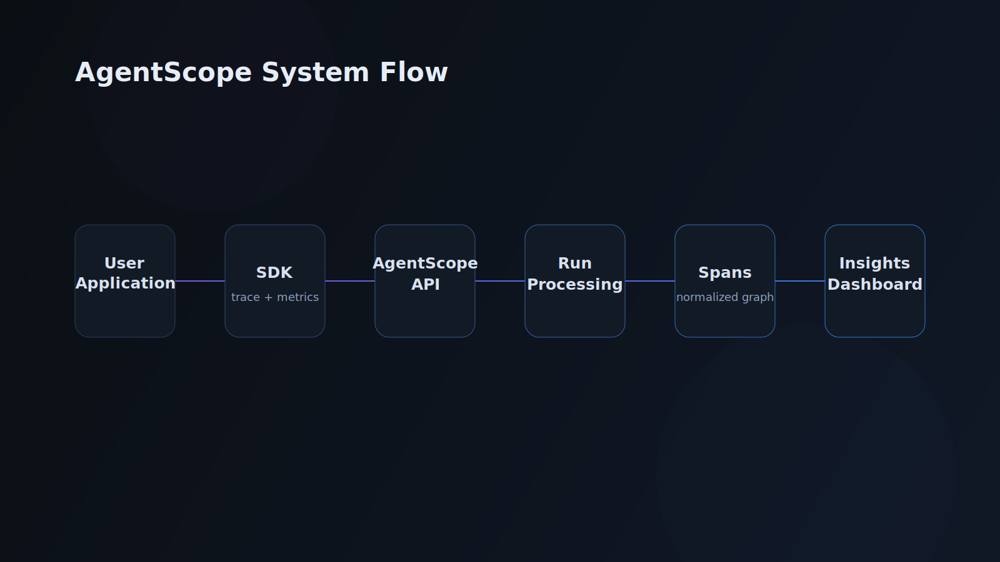

# AgentScope SaaS Graphics

Dark, minimal SVG graphics for AgentScope landing pages and docs.

## Files

- `system-flow-diagram.svg`
- `run-trace-visualization.svg`
- `root-cause-analysis.svg`
- `cost-performance-chart.svg`
- `sandbox-workflow.svg`

## Style Notes

- Background: `#0B0F14`
- Accent gradient: purple to blue (`#8B5CF6` to `#3B82F6`)
- Thin connector lines, rounded cards, subtle glow
- Failure states highlighted in red (`#EF4444`)

## Usage

Embed directly in markdown or HTML.

```md

```
